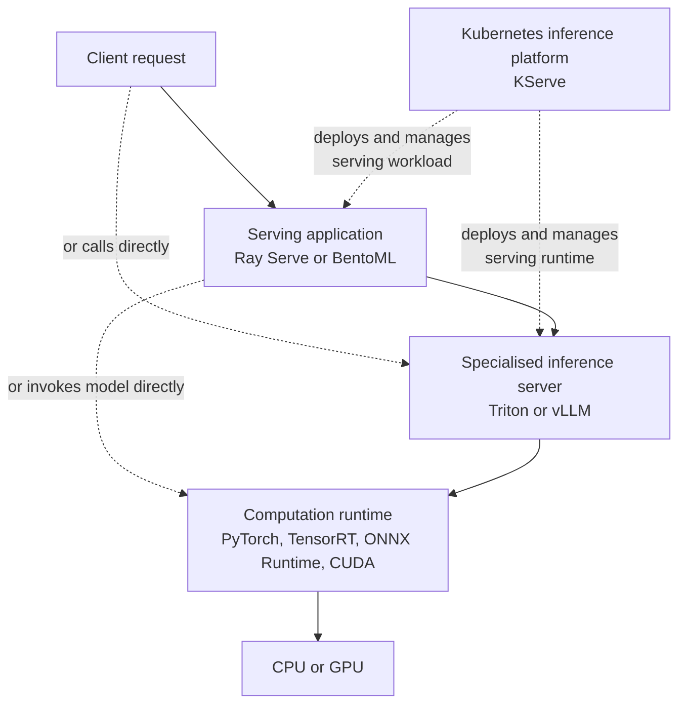

# AI Serving Technology Comparison

**Technologies:** NVIDIA Triton Inference Server, vLLM, Ray Serve, BentoML, and KServe  
**Last reviewed:** 30 July 2026

## 1. Purpose

This document compares five technologies that commonly appear in production AI-serving discussions:

- NVIDIA Triton Inference Server
- vLLM
- Ray Serve
- BentoML
- KServe

They are often placed in the same comparison because each can contribute to turning a trained model into a production inference service. However, they are not five interchangeable inference engines.

Their primary responsibilities differ:

```text
Triton    → general-purpose model server
vLLM      → specialised transformer and LLM inference engine/server
Ray Serve → distributed inference-application framework
BentoML   → AI-service definition, packaging, and serving framework
KServe    → Kubernetes-native inference lifecycle platform
```

The goal of this document is therefore not to rank them from best to worst. It is to:

1. Identify the architectural responsibility each technology primarily owns.
2. Explain where their capabilities overlap.
3. Define which comparisons are valid.
4. Select suitable technologies based on workload and system requirements.
5. Explain why Triton is appropriate for the current anomaly-inference platform and where vLLM or KServe could fit later.

## 2. Executive summary

The central conclusion is:

> Triton, vLLM, Ray Serve, BentoML, and KServe can all participate in model serving, but they optimise different units of the system.

| Technology | Primary focus | Main unit managed |
|---|---|---|
| **NVIDIA Triton** | General-purpose model serving | Models, versions, backends, requests, batches, and model instances |
| **vLLM** | High-performance transformer and LLM inference | Tokens, sequences, KV cache, batches, and accelerator memory |
| **Ray Serve** | Distributed inference applications | Python deployments, replicas, resources, and application graphs |
| **BentoML** | Building and packaging AI services | Services, APIs, models, dependencies, workers, and deployment configuration |
| **KServe** | Kubernetes inference lifecycle | Inference resources, serving runtimes, networking, rollout, and autoscaling configuration |

The most useful selection rule is:

| Primary problem | Most relevant technology |
|---|---|
| Serve predictive or mixed-framework models efficiently | Triton |
| Serve generative Transformer models efficiently | vLLM |
| Build a distributed, multi-stage Python inference application | Ray Serve |
| Package a reproducible model service with less custom serving code | BentoML |
| Standardise and manage inference workloads on Kubernetes | KServe |

## 3. Serving-stack terminology

### 3.1 Training framework

A training framework creates or fine-tunes a model.

Examples:

- PyTorch
- TensorFlow
- scikit-learn
- XGBoost
- Hugging Face Transformers with PyTorch

Neither Triton, Ray Serve, BentoML, nor KServe is primarily a training framework. vLLM is also primarily an inference system, although its ecosystem now includes integrations for reinforcement-learning and weight-transfer workflows.

### 3.2 Model artifact

The trained output that an inference system loads.

Examples:

- A scikit-learn pickle or joblib file
- ONNX model
- TensorRT engine
- PyTorch checkpoint
- Hugging Face model weights

### 3.3 Computation runtime

The software that performs the underlying model or tensor operations.

Examples:

- scikit-learn
- PyTorch
- TensorFlow
- ONNX Runtime
- TensorRT
- CUDA or ROCm kernels

### 3.4 Inference engine or model server

An inference engine/server takes substantial responsibility for loading models, scheduling work, batching requests, managing model instances or memory, and exposing inference APIs.

Examples:

- NVIDIA Triton
- vLLM
- TensorFlow Serving

### 3.5 Serving framework

A serving framework builds and operates the application around inference. It may expose APIs, host Python code, route requests, compose multiple stages, manage replicas, and autoscale deployments.

Examples:

- Ray Serve
- BentoML

A serving framework can invoke a model directly through PyTorch, scikit-learn, or another runtime. It can also call a specialised engine such as vLLM or Triton.

### 3.6 Serving platform

A serving platform manages the infrastructure lifecycle across serving workloads.

KServe is a Kubernetes-native serving platform. Its control plane creates and manages Kubernetes resources, while its selected data-plane runtime processes inference requests.

## 4. What “model execution” means

The phrase **model execution** is often used for three different activities:

1. **Hosting and invoking a model**
    - Load a model into a process.
    - Call `predict()` or `generate()`.

2. **Scheduling and optimising inference**
    - Batch requests.
    - Schedule sequences or model instances.
    - Manage KV cache or accelerator memory.

3. **Performing numerical computation**
    - Execute tensor operations and kernels through PyTorch, TensorRT, ONNX Runtime, CUDA, or another runtime.

Ray Serve and BentoML can host and invoke models directly. Triton and vLLM take deeper responsibility for inference scheduling and optimisation. All four still delegate the lowest-level numerical operations to model runtimes, libraries, and hardware kernels.

KServe is different again: its control plane manages the serving lifecycle, while the runtime selected by KServe hosts and executes the model.

## 5. Architectural position



The diagram represents possible responsibility boundaries, not a requirement to deploy every layer:

- Triton and vLLM can expose APIs directly.
- Ray Serve and BentoML can invoke models without a separate engine.
- Ray Serve or BentoML can wrap or integrate with vLLM or Triton.
- KServe manages the Kubernetes lifecycle of a selected serving runtime.
- A KServe runtime can contain Triton, a vLLM-backed server, an MLServer runtime, or a custom server.
- KServe’s dashed connections represent control-plane management, not an additional model-computation hop.

## 6. Technology profiles

### 6.1 NVIDIA Triton Inference Server

#### What it is

Triton is a dedicated, general-purpose inference server. It is designed to serve models from multiple frameworks through interchangeable backends.

An inference request follows approximately:

```text
HTTP/gRPC request
→ per-model scheduler
→ optional batching
→ selected backend
→ model computation
→ response
```

#### What Triton owns

- Model repository and version layout
- Model loading and unloading
- Per-model scheduling
- Dynamic batching
- Sequence batching for correlated or stateful request sequences
- Concurrent model instances
- Model pipelines through ensembles and business-logic scripting
- HTTP/REST and gRPC inference protocols
- Health, model, latency, throughput, and utilisation metrics
- Model-management APIs

#### What Triton delegates

The selected backend performs the model-specific inference:

- TensorRT backend → TensorRT engine
- ONNX backend → ONNX Runtime
- PyTorch backend → PyTorch runtime
- Python backend → arbitrary Python model code
- TensorRT-LLM or vLLM backend → specialised generative inference

#### Best fit

- Predictive ML
- Computer vision
- Traditional NLP
- Recommendation and ranking
- Mixed model frameworks
- Multi-model serving
- Workloads requiring model-level batching, versioning, and metrics

#### Limitations and trade-offs

- Triton is not a complete application framework.
- Complex business workflows usually remain outside Triton or require ensemble/BLS logic.
- Kubernetes lifecycle, rollout, and cluster-wide policy require Kubernetes tooling or a platform such as KServe.
- LLM serving requires an appropriate LLM backend; Triton’s core scheduler alone does not reproduce every specialised vLLM optimisation.
- Configuration and model-repository conventions add operational learning cost.

#### Current-project mapping

```text
Worker
→ Triton scheduler and dynamic batcher
→ Python backend
→ scikit-learn IsolationForest.predict()
→ CPU
```

Triton is responsible for serving and scheduling. The Python backend and scikit-learn perform the prediction.

Official reference: [Triton architecture](https://docs.nvidia.com/deeplearning/triton-inference-server/user-guide/docs/user_guide/architecture.html)

### 6.2 vLLM

#### What it is

vLLM is a specialised inference engine and server for generative and other Transformer-based models. It focuses on the unusual execution behaviour of autoregressive models, in which requests have different prompt lengths and produce different numbers of output tokens.

A typical request follows:

```text
OpenAI-compatible request
→ vLLM scheduler
→ continuous batching
→ KV-cache management
→ model runner and optimised kernels
→ streamed or complete response
```

#### What vLLM owns

- Continuous batching
- Sequence and token scheduling
- PagedAttention and KV-cache management
- Chunked prefill
- Prefix caching
- Quantisation integrations
- Speculative decoding
- Tensor, pipeline, expert, and data-parallel deployment options
- Streaming generation
- OpenAI-compatible APIs
- Transformer pooling tasks such as embedding, classification, reward, and scoring for supported models
- Inference and cache metrics

#### What vLLM delegates

- Model operations ultimately run through PyTorch and optimised CPU/GPU kernels.
- Cluster lifecycle, application composition, and organisation-wide serving policy can be delegated to Kubernetes, KServe, Ray Serve, or another platform.

#### Best fit

- Chat and text-generation models
- Code-generation models
- Multimodal generative models supported by vLLM
- Transformer embedding, classification, reward, and reranking workloads
- Workloads where time to first token, output-token throughput, and KV-cache efficiency matter

#### Limitations and trade-offs

- vLLM is not a general server for arbitrary scikit-learn, XGBoost, or conventional ONNX models.
- It does not replace a broad predictive-inference server such as Triton.
- Complex multi-stage application composition usually requires application code or a surrounding framework.
- Efficient production operation requires careful GPU-memory, cache, parallelism, and model-compatibility tuning.

#### Standalone and combined deployment

```text
Standalone:
Client → vLLM API server → Transformer model → GPU

With Ray Serve:
Client → Ray Serve → vLLM → GPU

With BentoML:
Client → BentoML Service → vLLM → GPU

With KServe:
Client → KServe-managed runtime → vLLM → GPU
```

Official references: [vLLM documentation](https://docs.vllm.ai/en/latest/), [OpenAI-compatible server](https://docs.vllm.ai/en/latest/serving/online_serving/openai_compatible_server/)

### 6.3 Ray Serve

#### What it is

Ray Serve is a distributed model-serving and application-composition framework built on Ray.

Its primary abstraction is a **deployment**: Python code running in one or more Ray actors. A deployment can contain model code, preprocessing, post-processing, business logic, or a specialised inference engine.

#### Direct model invocation

```python
@serve.deployment
class Predictor:
    def __init__(self):
        self.model = load_model()

    def __call__(self, request):
        return self.model.predict(request)
```

In this configuration:

```text
Ray Serve replica
→ model library such as scikit-learn or PyTorch
→ CPU/GPU computation
```

The model is hosted inside the Ray Serve process, but the model library performs the underlying computation.

#### What Ray Serve owns

- Distributed request routing
- Deployment and replica lifecycle
- Autoscaling
- CPU and GPU resource allocation
- Multi-node placement through Ray
- Model and service composition
- Independent scaling of pipeline stages
- Request batching
- Streaming responses
- Arbitrary Python application logic
- Multi-application and model-multiplexing patterns

#### What Ray Serve delegates

- Predictive model computation to scikit-learn, PyTorch, TensorFlow, or another library
- Specialised LLM scheduling and KV-cache optimisation to engines such as vLLM
- Container-image and environment delivery to the surrounding deployment workflow
- Kubernetes cluster lifecycle to Kubernetes/KubeRay or another platform layer

#### Best fit

- Distributed Python inference applications
- Multi-stage pipelines
- Independently scalable preprocessing, models, and post-processing
- Multi-node CPU/GPU workloads
- Applications already using the Ray ecosystem
- Workloads requiring flexible code composition more than a standard model endpoint

Example:

```text
Request validation
→ feature extraction deployment
→ anomaly-model deployment
→ risk-model deployment
→ response aggregation deployment
```

#### Limitations and trade-offs

- Operating Ray adds a distributed-systems control layer.
- It can overlap with Kubernetes scheduling and with an existing worker/orchestration architecture.
- Directly calling Hugging Face `generate()` does not automatically provide vLLM’s continuous batching and KV-cache optimisations.
- Packaging and reproducible container construction are not as central to Ray Serve as they are to BentoML.
- It can be excessive for a simple single-model endpoint.

#### Why combine Ray Serve with vLLM?

```text
Ray Serve
→ distributed routing, replicas, autoscaling, resource placement, composition

vLLM
→ token scheduling, continuous batching, KV cache, optimised LLM execution
```

Official references: [Ray Serve](https://docs.ray.io/en/latest/serve/index.html), [model composition](https://docs.ray.io/en/latest/serve/model_composition.html)

### 6.4 BentoML

#### What it is

BentoML is an AI-service definition, packaging, and serving framework. Its open-source core centres on defining services that combine model-loading logic, APIs, dependencies, runtime configuration, and deployment artifacts. BentoCloud adds a managed deployment and autoscaling platform.

#### Direct model invocation

```python
@bentoml.service
class Predictor:
    def __init__(self):
        self.model = load_model()

    @bentoml.api
    def predict(self, input):
        return self.model.predict(input)
```

In this configuration:

```text
BentoML Service
→ model library such as scikit-learn or PyTorch
→ CPU/GPU computation
```

#### What BentoML owns

- Service and API definition
- Model loading and management integrations
- Dependency and environment packaging
- Reproducible service artifacts
- Container-image construction
- Worker configuration and parallel request handling
- Adaptive batching
- Service and model composition
- Metrics, tracing, and logging integration
- CPU/GPU resource configuration
- Managed deployment and autoscaling when used with BentoCloud

#### What BentoML delegates

- Model computation to scikit-learn, PyTorch, TensorFlow, or another library
- Specialised LLM scheduling and KV-cache optimisation to engines such as vLLM
- Kubernetes infrastructure lifecycle to the selected deployment environment unless BentoCloud manages it

#### Best fit

- Teams wanting a fast path from trained model to reproducible API service
- Packaging models with preprocessing, dependencies, and configuration
- Small-to-medium service graphs
- Predictive inference
- LLM services that use an engine such as vLLM
- Teams prioritising developer experience and service portability

#### Limitations and trade-offs

- BentoML is not itself a low-level LLM token engine.
- Some platform features belong to BentoCloud rather than the open-source runtime alone.
- A team with established FastAPI, container, Kubernetes, metrics, and deployment conventions may experience capability overlap.
- It provides less of Ray’s general distributed-computing model for arbitrary multi-node application graphs.
- It provides less model-server specialisation than Triton for mixed backend and model-repository workflows.

#### Why combine BentoML with vLLM?

```text
BentoML
→ defines API, packages code and dependencies, configures and deploys service

vLLM
→ loads supported Transformer model and optimises token generation
```

Official references: [BentoML Services](https://docs.bentoml.com/en/latest/build-with-bentoml/services.html), [adaptive batching](https://docs.bentoml.com/en/latest/get-started/adaptive-batching.html), [BentoML with vLLM](https://docs.bentoml.com/en/latest/examples/vllm.html)

### 6.5 KServe

#### What it is

KServe is a Kubernetes-native model-serving platform. It separates:

- **Control plane:** manages inference resources and their lifecycle.
- **Data plane:** accepts requests and performs inference through the selected serving runtime.

KServe does not replace the model server’s numerical execution. It selects, configures, deploys, exposes, and operates the runtime that performs inference.

#### Control plane responsibilities

- Kubernetes custom resources such as `InferenceService`
- ServingRuntime and ClusterServingRuntime selection
- Creation and management of Deployments, Services, and networking resources
- Model storage integration
- Revision, rollout, and traffic-management patterns depending on deployment mode
- Autoscaling integration
- Inference graphs and model composition at the platform level
- Standardised inference protocols and organisational runtime templates

#### Data plane responsibilities

The selected runtime handles inference. Examples include:

- `kserve-tritonserver`
- `kserve-huggingfaceserver`
- `kserve-mlserver`
- `kserve-sklearnserver`
- `kserve-xgbserver`
- Custom runtimes

A `ServingRuntime` is effectively a reusable template that defines:

- The serving container image
- Supported model formats
- Container commands and arguments
- Environment and runtime configuration

#### Predictive-inference path

```text
InferenceService YAML
→ KServe controller
→ Kubernetes resources
→ selected predictive runtime
→ trained model
→ CPU/GPU
```

#### Generative-inference path

```text
KServe control plane
→ deploys Hugging Face serving runtime
→ runtime uses vLLM backend
→ vLLM executes generative inference
→ GPU
```

#### Best fit

- Kubernetes platform teams
- Standardising many model-serving workloads
- Supporting multiple model formats and runtime teams
- Self-service model deployment through CRDs
- Organisation-wide networking, autoscaling, and rollout conventions
- Predictive and generative inference fleets

#### Limitations and trade-offs

- Requires Kubernetes and adds CRDs, controllers, and platform-level operational complexity.
- The performance and model support of the data plane depend on the selected runtime.
- It does not automatically replace custom business logic, Redis queues, QoS scheduling, or application workflows.
- It may be excessive for a small number of manually managed inference deployments.
- Combining it with another orchestration framework can create overlapping control layers.

Official references: [KServe architecture](https://kserve.github.io/website/docs/concepts/architecture), [ServingRuntime](https://kserve.github.io/website/docs/concepts/resources/servingruntime), [generative runtime](https://kserve.github.io/website/docs/model-serving/generative-inference/overview)

## 7. Capability matrix

The table describes primary product capabilities. **Via runtime** means that the platform can provide the capability by selecting or hosting another component rather than implementing the computation itself.

| Capability | Triton | vLLM | Ray Serve | BentoML | KServe |
|---|---|---|---|---|---|
| Predictive ML | Strong | Limited to supported Transformer tasks | Strong through Python/model libraries | Strong through services/model libraries | Strong via selected runtime |
| Generative LLMs | Supported through suitable backend | Core focus | Strong, commonly with vLLM | Strong, commonly with vLLM | Strong via generative runtime |
| Arbitrary Python logic | Python backend/BLS | Limited extension scope | Core strength | Core strength | Via custom runtime/transformer |
| Mixed model frameworks | Core strength | No | Supported through application code | Supported through services | Supported through multiple runtimes |
| Dynamic/adaptive request batching | Dynamic and sequence batching | Continuous batching | Request batching | Adaptive batching | Depends on selected runtime |
| KV-cache management | Through LLM backend | Core strength | Through underlying LLM engine | Through underlying LLM engine | Through selected LLM runtime |
| Model repository/version layout | Core strength | Model-loader/config dependent | External or application defined | Model-management/package workflow | Storage/runtime integration |
| Application composition | Ensembles and BLS | Limited | Core strength | Strong | InferenceGraph/runtime patterns |
| Replica autoscaling | External orchestrator | External or integration dependent | Core capability | Deployment-platform dependent | Kubernetes autoscaling integration |
| Multi-node resource scheduling | External orchestrator/backend | Supported execution modes; deployment integration needed | Core Ray capability | Deployment-platform dependent | Kubernetes plus selected runtime |
| API generation | Inference APIs | OpenAI-compatible server | Python ingress and deployments | Core strength | Standard endpoint via runtime/networking |
| Packaging dependencies | Container/model repository managed externally | Container/environment managed externally | Runtime environment/deployment workflow | Core strength | Runtime images managed by platform teams |
| Kubernetes-native lifecycle | Deployable on Kubernetes | Deployable on Kubernetes | Through KubeRay/Kubernetes | Deployable to Kubernetes/BentoCloud | Core strength |
| Model-level metrics | Core strength | Core inference/cache metrics | Application/deployment metrics | Service metrics | Platform plus runtime metrics |
| Primary abstraction | Model | Sequence/token request | Deployment/replica | Service | Inference resource/runtime |

## 8. Key conceptual comparisons

### 8.1 Predictive versus generative inference

Predictive inference usually maps one fixed-shape or batchable input to one output:

```text
features → model.predict() → prediction
```

Examples:

- Anomaly detection
- Fraud classification
- Image classification
- Ranking
- Forecasting

Generative inference often executes iteratively:

```text
prompt
→ prefill
→ generate token
→ update KV cache
→ generate next token
→ repeat until completion
```

Different prompt lengths, output lengths, streaming, and cache pressure require specialised scheduling. This is why vLLM exists as a distinct engine and why ordinary request batching is insufficient for high-performance LLM serving.

### 8.2 Dynamic, adaptive, sequence, and continuous batching

| Batching type | Main idea | Typical technology |
|---|---|---|
| **Dynamic batching** | Wait briefly to combine independent requests into a model batch | Triton |
| **Adaptive batching** | Adjust dispatch batch size/window based on traffic and configured limits | BentoML |
| **Request batching** | Group requests before calling deployment logic | Ray Serve |
| **Sequence batching** | Preserve routing and ordering for related stateful sequences | Triton |
| **Continuous batching** | Add and remove sequences while iterative generation is running | vLLM |

These mechanisms should not be compared solely by name. Continuous batching solves a different scheduling problem from batching fixed predictive requests.

### 8.3 Engine/server versus serving framework

```text
Engine/server:
How should inference requests be scheduled and executed efficiently?

Serving framework:
How should the inference application be composed, routed, scaled, and operated?
```

Triton and vLLM lean toward the first question. Ray Serve and BentoML cover more of the second.

### 8.4 Control plane versus data plane

```text
Control plane:
What should run, where should it run, and how should its lifecycle be managed?

Data plane:
How are live inference requests processed?
```

KServe primarily provides the Kubernetes inference control plane. Its selected runtime—such as Triton or a vLLM-backed Hugging Face server—forms the inference data plane.

### 8.5 Direct model invocation versus specialised-engine integration

Ray Serve and BentoML can invoke a model directly:

```text
Framework process
→ PyTorch/Transformers model.generate()
→ GPU
```

They can instead use a specialised engine:

```text
Framework process
→ vLLM
→ continuous batching and KV-cache management
→ GPU
```

Both approaches execute the model, but the second adds engine-level inference optimisation.

## 9. Why these technologies are compared

They can all contribute to the broad outcome:

> Expose a trained model as a reliable, scalable production service.

This creates functional overlap:

- All can participate in exposing inference endpoints.
- Most can run in Kubernetes.
- Most provide or integrate with batching.
- Most provide metrics and scaling integrations.
- Ray Serve and BentoML can host model execution directly.
- Triton and vLLM can operate as standalone servers.
- KServe can deploy and manage several of the others as runtimes.

They are therefore valid **solution-selection candidates**, but not necessarily valid **same-layer benchmark candidates**.

## 10. Valid and misleading comparisons

### 10.1 Reasonably direct comparisons

#### Ray Serve versus BentoML

Compare them when selecting the main framework for an inference application:

- Application composition
- Developer experience
- API definition
- Packaging
- Replica management
- Autoscaling
- Distributed execution
- Operational complexity

#### Triton versus other general model servers

Compare:

- Model-framework support
- Dynamic batching
- Concurrent execution
- Model lifecycle
- Protocols
- Performance
- Model-level observability

#### vLLM versus other LLM engines

Compare:

- Time to first token
- Inter-token latency
- Request and token throughput
- KV-cache efficiency
- Parallelism
- Quantisation
- Supported architectures
- Operational stability

#### Manual Kubernetes versus KServe

Compare:

- Deployment standardisation
- CRD complexity
- Runtime flexibility
- Rollout support
- Autoscaling integration
- Model storage
- Platform-team effort
- Developer self-service

### 10.2 Partial comparison: Triton versus vLLM

Both can expose model endpoints, but their native workloads differ:

- Triton is general-purpose and multi-framework.
- vLLM specialises in generative and Transformer-based inference.

A useful LLM comparison must define Triton’s backend:

```text
vLLM standalone
versus
Triton + vLLM backend
versus
Triton + TensorRT-LLM backend
```

Comparing “Triton” with “vLLM” without identifying the backend and model path is incomplete.

### 10.3 Whole-stack comparisons

For LLM serving, compare deployable solutions:

```text
Option A: vLLM standalone
Option B: Ray Serve + vLLM
Option C: BentoML + vLLM
Option D: KServe + vLLM-backed runtime
Option E: Triton + vLLM or TensorRT-LLM backend
```

Hold constant:

- Model and model revision
- Quantisation
- Engine version
- Hardware
- Tensor/pipeline parallelism
- Input/output token distribution
- Request concurrency
- Streaming behaviour

Then evaluate both performance and the operational capabilities added around the engine.

### 10.4 Misleading comparisons

- Raw vLLM token throughput versus Ray Serve without stating Ray Serve’s underlying LLM engine
- KServe versus Triton without separating control plane from data plane
- Triton batching performance versus BentoML packaging experience
- vLLM versus Triton for an IsolationForest model
- Ray Serve versus vLLM as if both were only token schedulers
- Open-source BentoML versus a managed platform without identifying which BentoCloud features are included

## 11. Scenario-based selection

| Scenario | Suitable choice | Reason |
|---|---|---|
| Scikit-learn, ONNX, TensorRT, or mixed predictive models | Triton | General-purpose backends, model scheduling, dynamic batching, and model metrics |
| High-throughput LLM generation | vLLM | Continuous batching, PagedAttention, KV-cache management, and token scheduling |
| Multi-stage Python inference graph | Ray Serve | Independent deployments, routing, composition, and distributed scaling |
| Fast path from trained model to packaged service | BentoML | Service definition, dependencies, APIs, containerisation, and adaptive batching |
| Standardised inference platform across Kubernetes | KServe | CRDs, runtime templates, lifecycle management, and Kubernetes integration |
| Kubernetes-managed predictive serving | KServe + Triton or another predictive runtime | KServe manages lifecycle; runtime serves the model |
| Kubernetes-managed generative serving | KServe + vLLM-backed runtime | KServe manages lifecycle; vLLM optimises LLM inference |
| Complex distributed LLM application | Ray Serve + vLLM | Ray composes/scales application stages; vLLM optimises tokens |
| Reproducible LLM API package | BentoML + vLLM | BentoML packages and exposes the service; vLLM performs optimised inference |
| Simple single-model LLM endpoint | vLLM standalone | Avoid unnecessary framework layers |

## 12. Mapping to the anomaly-inference platform

### 12.1 Current architecture

```text
Kubernetes
→ deployment and infrastructure management

FastAPI
→ request validation, admission, and API endpoints

Redis + workers
→ asynchronous queues, QoS, adaptive batching, and orchestration

NVIDIA Triton
→ dedicated model server, model routing, and dynamic batching

Python backend + scikit-learn
→ IsolationForest computation

CPU
→ hardware execution
```

### 12.2 Responsibility mapping

| Current component | Comparable technology responsibility |
|---|---|
| FastAPI endpoints and orchestration | Parts could be implemented with Ray Serve or BentoML |
| Redis workers and multi-stage logic | Ray Serve could implement some distributed composition |
| Triton server | Triton’s direct responsibility |
| IsolationForest computation | scikit-learn inside Triton’s Python backend |
| Kubernetes manifests and lifecycle | KServe could manage part of this layer |
| Future generative path | vLLM |
| Future LLM application composition | Optionally Ray Serve or BentoML around vLLM |

## 13. Technology decision for this project

### 13.1 Why Triton was selected

The platform already had:

- FastAPI request handling
- Redis queues
- VIP/shared-worker QoS
- Adaptive worker batching
- Kubernetes deployments
- Autoscaling
- Prometheus and Grafana observability

The missing architectural responsibility was a dedicated model server.

Triton added:

- Centralised model loading
- Model repository and versions
- Runtime model routing
- Per-model scheduling
- Dynamic batching
- Concurrent model execution
- Model-level inference metrics
- A clean worker-to-model-server boundary

Ray Serve and BentoML would have overlapped more heavily with the application and orchestration layers that were already implemented.

### 13.2 Future role of vLLM

vLLM is the most valuable next technology for demonstrating genuine generative inference concepts:

- Token-based scheduling
- Continuous batching
- Prefill and decode behaviour
- Time to first token
- Inter-token latency
- KV-cache utilisation
- GPU-memory pressure
- Quantisation
- LLM-specific capacity planning

It complements the predictive Triton path rather than replacing it:

```text
Predictive inference → Triton
Generative inference → vLLM
```

### 13.3 Future role of KServe

KServe becomes valuable when the project’s focus moves from operating one inference deployment to designing a reusable inference platform:

- Multiple teams
- Many models
- Multiple serving runtimes
- Standardised deployment APIs
- Model storage integration
- Consistent rollout and autoscaling policies
- Kubernetes-based developer self-service

It is a strong platform-design or Cloud MVP extension, but it is not required to prove the current Triton deployment.

### 13.4 Why Ray Serve and BentoML remain comparison-level technologies

They are legitimate alternatives, not inferior products:

- Ray Serve is compelling for distributed Python pipelines and multi-stage inference applications.
- BentoML is compelling for packaging and shipping reproducible AI services quickly.

Adding either now would duplicate responsibilities already demonstrated by FastAPI, workers, Kubernetes, and the existing deployment workflow. The portfolio gains more new AI-infrastructure depth from adding vLLM/GPU-serving concepts than from rebuilding the same application layer with another framework.

## 14. Benchmarking methodology

Performance comparisons must hold the architectural layer and underlying execution stack constant.

### 14.1 Predictive inference metrics

- Requests per second
- P50, P95, and P99 end-to-end latency
- Queue latency
- Model execution latency
- Effective batch size
- Batch flush reason
- CPU/GPU utilisation
- Memory consumption
- Error and rejection rates
- Cold-start/model-loading time
- Replica count
- Cost per request

### 14.2 Generative inference metrics

- Time to first token
- Inter-token latency or time per output token
- End-to-end request latency
- Request throughput
- Input-token throughput
- Output-token throughput
- Running, waiting, and preempted requests
- KV-cache utilisation
- GPU compute and memory utilisation
- Prefix-cache hit rate where applicable
- Preemption or recomputation rate
- Cost per generated token

### 14.3 Experiment controls

- Same model and revision
- Same precision or quantisation
- Same engine and framework versions
- Same hardware
- Same replica and parallelism configuration
- Same prompt/input distribution
- Same generated-output distribution
- Same concurrency and arrival pattern
- Same warm-up policy
- Same SLO

### 14.4 Example valid experiment

```text
Stack A: vLLM standalone
Stack B: Ray Serve + same vLLM version

Measure:
- framework routing overhead
- scaling behaviour
- failure recovery
- operational complexity
- performance at equal replica count
```

This isolates what Ray Serve adds around the same engine.

## 15. Operational trade-offs

Framework selection should include more than raw throughput:

- Deployment complexity
- Control-plane complexity
- Debugging difficulty
- On-call burden
- Upgrade compatibility
- Team expertise
- Failure domains
- Observability integration
- Model cold starts
- Artifact storage and distribution
- Security boundaries
- Tenant isolation
- Backpressure and overload behaviour
- GPU fragmentation and idle capacity
- Portability and vendor dependence
- Cost per request or token

Adding layers can improve standardisation and developer experience, but each layer also adds configuration, failure modes, and operational ownership.

## 16. Final recommendation

These technologies should not be memorised as a flat list of five equivalent serving engines.

Use this mental model:

```text
Triton
→ specialised server for general and mixed-framework model inference

vLLM
→ specialised engine/server for generative and Transformer inference

Ray Serve
→ distributed inference-application framework

BentoML
→ AI-service packaging and serving framework

KServe
→ Kubernetes inference-lifecycle platform
```

For this project:

```text
Current predictive inference → Triton
Future generative inference  → vLLM
Application orchestration    → FastAPI + Redis workers
Current lifecycle management → Kubernetes manifests
Future platform evaluation   → KServe
Comparison-level knowledge   → Ray Serve and BentoML
```

The strongest selection principle is:

> Start with the workload and the missing architectural responsibility. Select an engine when execution efficiency is missing, a serving framework when application composition or packaging is missing, and a platform when fleet-wide deployment lifecycle management is missing.

## 17. Official references

- [NVIDIA Triton architecture](https://docs.nvidia.com/deeplearning/triton-inference-server/user-guide/docs/user_guide/architecture.html)
- [vLLM documentation](https://docs.vllm.ai/en/latest/)
- [vLLM OpenAI-compatible server](https://docs.vllm.ai/en/latest/serving/online_serving/openai_compatible_server/)
- [Ray Serve documentation](https://docs.ray.io/en/latest/serve/index.html)
- [Ray Serve model composition](https://docs.ray.io/en/latest/serve/model_composition.html)
- [BentoML Services](https://docs.bentoml.com/en/latest/build-with-bentoml/services.html)
- [BentoML adaptive batching](https://docs.bentoml.com/en/latest/get-started/adaptive-batching.html)
- [BentoML vLLM example](https://docs.bentoml.com/en/latest/examples/vllm.html)
- [KServe architecture](https://kserve.github.io/website/docs/concepts/architecture)
- [KServe ServingRuntime](https://kserve.github.io/website/docs/concepts/resources/servingruntime)
- [KServe predictive-serving frameworks](https://kserve.github.io/website/docs/model-serving/predictive-inference/frameworks/overview)
- [KServe generative runtime](https://kserve.github.io/website/docs/model-serving/generative-inference/overview)
